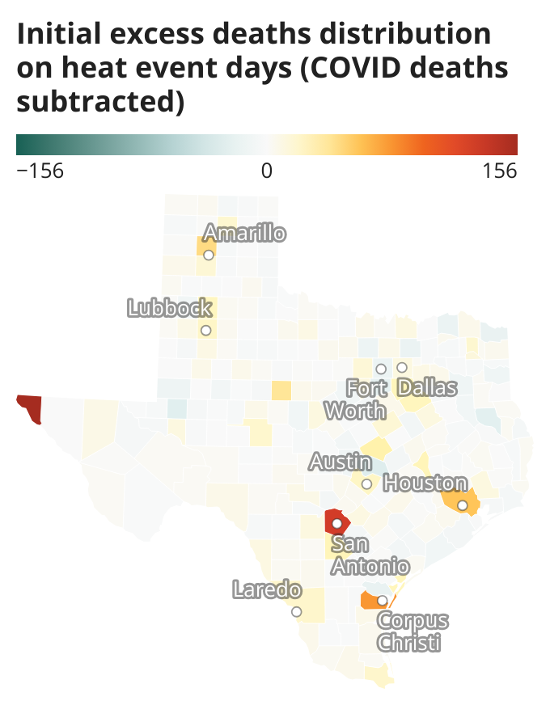
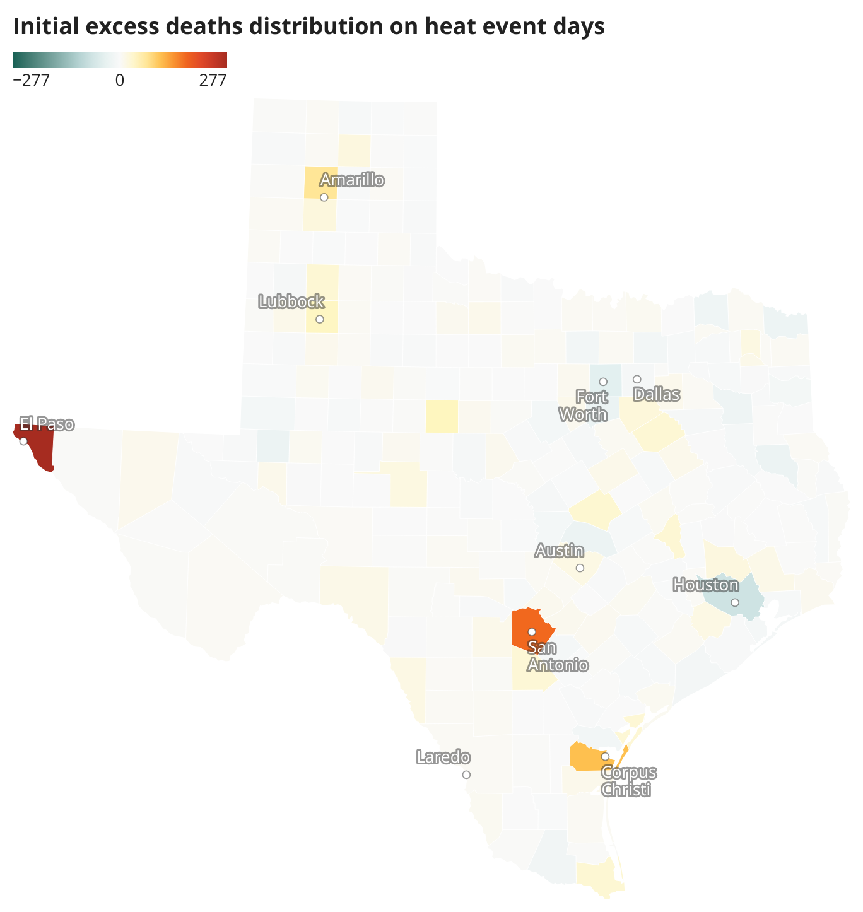
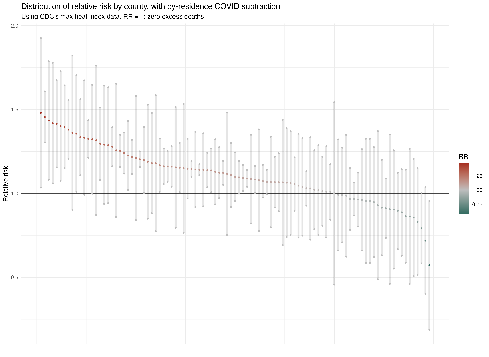

# Excess heat deaths analysis
This repository includes data and code used for a statistical analysis which aims to estimate the number of people who died of heat between 2020 and 2022, using death indexes data and heat index data.

Texas Tribune has reported official heat-related deaths tolls counted by the state's health department (DSHS) in [2022](https://www.texastribune.org/2023/01/26/texas-heat-deaths-migrants-climate-change/) and [2023](https://www.texastribune.org/2024/01/12/texas-heat-deaths-2023-record-climate-change/) although we've repeatedly reported data is "likely a dramatic undercount".

In short, this analysis aims to estimate the excess deaths on extreme heat days for 99 largest counties in Texas between May and September in 2020, 2021 and 2022, so that we can compare our estimates with DSHS' official tally, showing undercounts, and hopefully holding officials accountable.

The analysis is hugely inspired by and mostly follows [an analysis conducted by the Los Angeles Times](https://github.com/datadesk/extreme-heat-excess-deaths-analysis) in 2021 for [this story](https://www.latimes.com/projects/california-extreme-heat-deaths-show-climate-change-risks/). 

We built a statistical model to predict a 'normal' daily death counts on a day in a county between 2020 and 2022, had it not been an extreme heat day. To build a model, we used daily death tolls and maximum heat index for each county between 2013 and 2019. In other words, we built a model using pre-COVID data, and using that model, we estimated daily excess deaths by county during the pandemic. We are 

The 99 counties included in this analysis had more than 25,000 people in the 2020 Census. We needed to exclude smaller counties from this analysis because there were simply not enough data to build a robust model and make an estimate. We set this 25,000 threshold because it would cover more than 90% (actually 94.8%) of the state's population.

Daily excess deaths is calculated as actual deaths minus estimated deaths. For each 2013-2019 daily maximum heat index estimate, we defined whether the day was an extreme heat day -- above the county's 95th percentile value of 1981-2010 maximum heat index distribution. And the model explains, for each county, actual deaths as a function of whether it was an extreme heat day, while also controlling for 1) a year (to account for deaths or even crude death rates to naturally increasing due to population aging), 2) a month and 3) whether it was in the weekend (since there may be fewer death certificate submissions), as well as accounting for 4) a population increase.

After 2020, there are so many more excess deaths than before 2019, not surprisingly because of the COVID-19 pandemic. And it may be safe to think most excess deaths are due to COVID. To account for COVID deaths, we simply subtracted, from estimated excess deaths, the number of people who died of COVID (* as of May 24, the data is based on county of residence, so it's not accurate). We also subtracted deaths due to mass shootings.

Although our results have margins of errors, by looking at the average of lower and upper end of the estimates, 75 out of 99 (75.8%) of the Texas' largest counties recorded excess deaths on extreme heat days. And the total number of excess deaths (with by-residence COVID deaths subtracted) is 5,033 from 2020 to 2022. According to the state's health department (DSHS), the total [heat-related deaths in statewide Texas](https://www.texastribune.org/2024/01/12/texas-heat-deaths-2023-record-climate-change) was 618 from 2020 to 2022, fewer than one eights (12.3%) of our excess deaths estimate.

## Presets:
- **Study months**: This analysis estimates the number of people who died of heat between May and September. These months are chosen because 1) based on CDC's [Heat & Health Tracker](https://ephtracking.cdc.gov/Applications/heatTracker/). Its data about emergency department visits for Heat-Related Illness (HRI) start to increase around the beginning of May and decrese around the end of September in Region 6 (which includes AR, LA, NM, OK and TX), and 2) CDC's Heat & Health Tracker loosely defines summer months as May to September; As an indicator about people's health status with respect to environmental factors, CDC has a [data category](https://ephtracking.cdc.gov/indicatorPages?selectedContentAreaAbbreviation=35&selectedIndicatorId=97) about *"Daily Estimates of Maximum Heat Index for Summer Months (May–September)"*.
- **Extreme heat days**: Extreme heat days are defined by the county’s 95th percentile value of historical (1981–2010) maximum heat index distribution. This is following LAT's methodology and CDC's Heat & Health Tracker, as well as other similar studies.
- **99 counties**: Counties included in this analysis had more than 25,000 people in the 2020 Census. This covers about 95% of the state's population. These counties are: Anderson, Angelina, Atascosa, Austin, Bastrop, Bee, Bell, Bexar, Bowie, Brazoria, Brazos, Brown, Burnet, Caldwell, Cameron, Cass, Chambers, Cherokee, Collin, Comal, Cooke, Coryell, Dallas, Denton, Ector, Ellis, El Paso, Erath, Fannin, Fort Bend, Galveston, Gillespie, Grayson, Gregg, Grimes, Guadalupe, Hale, Hardin, Harris, Harrison, Hays, Henderson, Hidalgo, Hill, Hood, Hopkins, Howard, Hunt, Jasper, Jefferson, Jim Wells, Johnson, Kaufman, Kendall, Kerr, Kleberg, Lamar, Liberty, Lubbock, Matagorda, Maverick, Mclennan, Medina, Midland, Montgomery, Nacogdoches, Navarro, Nueces, Orange, Palo Pinto, Parker, Polk, Potter, Randall, Rockwall, Rusk, San Jacinto, San Patricio, Smith, Starr, Tarrant, Taylor, Titus, Tom Green, Travis, Upshur, Val Verde, Van Zandt, Victoria, Walker, Waller, Washington, Webb, Wharton, Wichita, Williamson, Wilson, Wise, and Wood County.

## Data findings:
- Output data: [Spreadsheet](https://docs.google.com/spreadsheets/d/15PRJfTR8asQS1IhYGmqdw0GQ44rK5OtqIK9TlxjRUAg/edit#gid=119782735)
- Geographical distribution on relative risk (the number of people who died on extreme heat days divided by the estimated number of people who would have died had it not been an extreme heat day) on heat event days based on initial preliminary analysis:
[Map (by-residence COVID deaths subtracted)](https://www.datawrapper.de/_/LTVsM/) | [Map (COVID deaths not subtracted)](https://www.datawrapper.de/_/aFPMM/)
It's important to look at relative risk rather than excess deaths per capita, since it indirectly accounts for population and other factors (age etc.) associated with counties. If two counties had the same population and same excess deaths on extreme heat days, per-capita excess deaths would be the same. But if one county's (county A) estimated deaths were half the size of the other county (county B), then relative risk on extreme heat days would be much higher in county A. This means that county A is much more vulnerable to extreme heat compared to county B.

## Data sources:
- **Death indexes**:
  - [Texas Department of State Health Services Vital Statistics](https://www.dshs.texas.gov/vital-statistics/death-records/birth-death-indexes). Data includes descendant's 1) name, 2) date of death, 3) county of death by occurrence, and 4) sex. At the time of this analysis, the data were only avaiable up to 2022. According to DSHS' vital statistics section, the 2023 data is not available until early 2025 because "records can still be filed".

- **Covid deaths**:
  - Daily covid fatalities by county to get an idea of the nubmer of excess deaths without COVID deaths. [Texas Department of State Health Services](https://www.dshs.texas.gov/covid-19-coronavirus-disease-2019/texas-covid-19-data). Data is based on county of residence.

- **Population data**:
  - We offset the model by annual population estimates. Data by U.S. Census, [2020-2022](https://www.census.gov/data/tables/time-series/demo/popest/2020s-counties-total.html).

- **Heat indexes**: 
  - Daily estimates of maximum heat indexes were also provided by [CDC's Heat & Health Tracker](https://ephtracking.cdc.gov/Applications/heatTracker/). The data is caluculated using air temperature and humidity at a gridded level and summarized to the county level. More about data [here](https://ephtracking.cdc.gov/indicatorPages?selectedContentAreaAbbreviation=35&selectedIndicatorId=97).
  - Daily estimates of maximum heat indexes were calculated by using daily maximum temperature and daily minimum relative humidity, obtained from [gridMET](https://www.climatologylab.org/gridmet.html), a gridded surface meteorological dataset, using an R package [climateR](https://github.com/mikejohnson51/climateR). **We ended up not using this data because we found a county-level daily maximum heat index provided by CDC (more accurate).** Data provided by [gridMET](https://www.climatologylab.org/gridmet.html) is gridded for ~4km resolution. To obtain data representative for each county, the grids were centered the [2020 Centers of Population](https://www.census.gov/geographies/reference-files/time-series/geo/centers-population.html) by the U.S. Census.

- **Mass shooting deaths**: 
  - After conducting an initial analysis, we found an abnormal number of excess deaths in some counties. We then identified these deaths happened on a day in a county where a mass shooting happened. In this analysis, we simply subtract the number of people who died from mass shootings. Data are compiled through [Tribune's analysis](https://apps.texastribune.org/features/2019/texas-10-years-of-mass-shootings-timeline/).

All data are uploaded [here](https://drive.google.com/drive/u/0/folders/1vCKHO1FFF2gddAbXLA9r1lOrOscSAWrN).

This analysis was conducted with guidance from [Ariel Karlinsky](https://akarlinsky.github.io/), an economist and statistician at Hebrew University, [Ebrahim Eslami](https://harcresearch.org/people/ebrahim-eslami-phd/), a research scientist at HARC, and Texas State Climatologist [John Nielsen-Gammon](https://atmo.tamu.edu/people/profiles/faculty/nielsen-gammonjohn.html).

This project was originally pitched by Tribune's former climate reporter [Erin Douglas](https://www.bostonglobe.com/about/staff-list/staff/erin-douglas/), who is now a climate reporte for The Boston Globe.

Since this analysis involves building a statistical model, most of it was conducted using a computational language `R`.