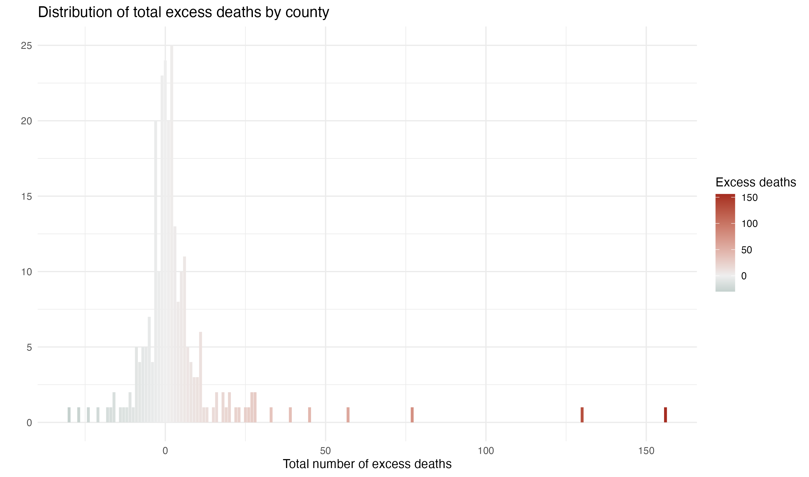

# Excess heat deaths analysis
This repository includes data and code used for a statistical analysis which aims to estimate the number of people who died of heat between 2018 and 2022, using death indexes data and heat index data.

The analysis is inspired by and mostly follows [an analysis conducted by the Los Angeles Times](https://github.com/datadesk/extreme-heat-excess-deaths-analysis) in 2021 for [this story](https://www.latimes.com/projects/california-extreme-heat-deaths-show-climate-change-risks/).

This analysis was conducted with guidance from [Ariel Karlinsky](https://akarlinsky.github.io/), an economist and statistician at Hebrew University, [Ebrahim Eslami](https://harcresearch.org/people/ebrahim-eslami-phd/), a research scientist at HARC, and Texas State Climatologist [John Nielsen-Gammon](https://atmo.tamu.edu/people/profiles/faculty/nielsen-gammonjohn.html).

Since this analysis involves building a statistical model, most of it was conducted using a computational language `R`.

## Key findings:
- Output data: [Spreadsheet](https://docs.google.com/spreadsheets/d/15PRJfTR8asQS1IhYGmqdw0GQ44rK5OtqIK9TlxjRUAg/edit#gid=119782735)
- Geographical distribution on excess deaths on heat event days based on initial preliminary analysis: [Map](https://www.datawrapper.de/_/aFPMM/)

## Data sources:
- **Death indexes**:
  - [Texas Department of State Health Services Vital Statistics](https://www.dshs.texas.gov/vital-statistics/death-records/birth-death-indexes)

- **Covid deaths**:
  - We gathered daily covid fatalities by county just in case. [Texas Department of State Health Services](https://www.dshs.texas.gov/covid-19-coronavirus-disease-2019/texas-covid-19-data)

- **Population data**:
  - We offset the model by annual population estimates. Data by U.S. Census, [2020-2023](https://www.census.gov/data/tables/time-series/demo/popest/2020s-counties-total.html) and [2013-2019](https://www.census.gov/data/datasets/time-series/demo/popest/2010s-counties-total.html)

- **Heat indexes**: 
  - Daily maximum heat indexes were calculated by using daily maximum temperature and daily minimum relative humidity, obtained from [gridMET](https://www.climatologylab.org/gridmet.html), a gridded surface meteorological dataset, using an R package [climateR](https://github.com/mikejohnson51/climateR).
  - Data provided by [gridMET](https://www.climatologylab.org/gridmet.html) is gridded for ~4km resolution. To obtain data representative for each county, the grids were centered the [2020 Centers of Population](https://www.census.gov/geographies/reference-files/time-series/geo/centers-population.html) by the U.S. Census.

All data are uploaded [here](https://drive.google.com/drive/u/0/folders/1vCKHO1FFF2gddAbXLA9r1lOrOscSAWrN).